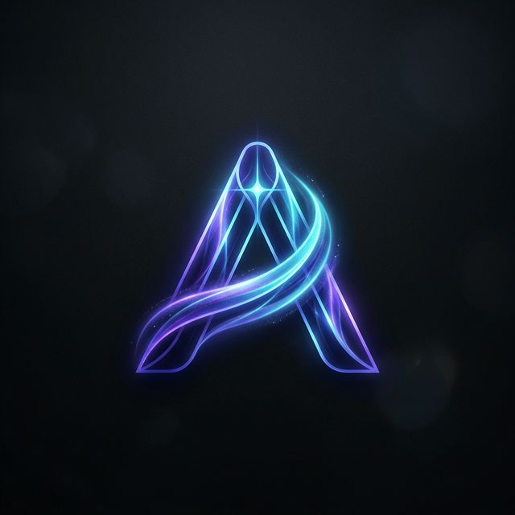

  

  # Aurora Access

  > “Freedom is not a feature — it’s a right written in light.”

  
  

---

###  Our Vision
Aurora Access is dedicated to the development of **decentralized, secure, and resilient infrastructure**. We believe in building systems where privacy and freedom are embedded at the architectural level.

### 🛠 Core Technologies

- **[A-VM](https://github.com/AuroraAccess/A-VM)**: The Aurora Virtual Machine — a high-performance, secure execution environment for decentralized applications.
- **[A-Code](https://github.com/AuroraAccess/A-Code)**: Native bytecode optimized for low-latency, cross-platform performance within the Aurora ecosystem.
- **[RCF (Restricted Correlation Framework)](https://github.com/aliyevaladddin/rcf-protocol)**: A security-first protocol layer ensuring data integrity and restricted access through advanced cryptographic markers.

### Security Redefined
Our ecosystem implements cutting-edge protection mechanisms:
- **Active Shielding (Bunker Mode)**: Physical and digital protection against side-channel attacks and power dumping.
- **Post-Quantum Integrity**: Future-proofing our modules with Dilithium-based verification layers.

---

###  Founder & Architect: Aladdin Aliyev
Building the future of secure systems, one line of bytecode at a time.

---

  Built on Web Standards. Powered by Light.

